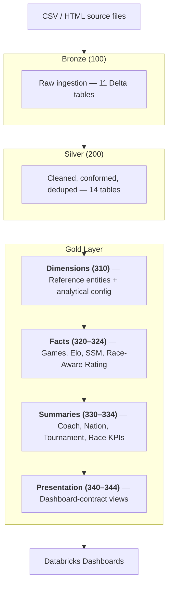
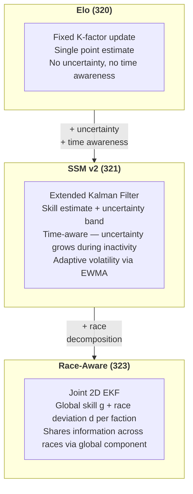

# NAF Databricks Project

A data engineering and analytics project built on Databricks that transforms raw NAF (Blood Bowl) match and tournament data into structured analytical datasets, rating systems and interactive dashboards.

## Overview

The NAF maintains a global registry of sanctioned Blood Bowl tournaments and match results. This project ingests that data and builds a layered analytical pipeline covering coach ratings, nation-level aggregations, tournament statistics and race/faction analysis. The pipeline emphasises reproducibility, data quality, centralised configuration and transparent analytical logic.

## Architecture

The pipeline follows a medallion architecture. Each layer builds on the previous one, with clear contracts between them:



All tuneable parameters (Elo settings, SSM hyperparameters, race-rating config, activity windows, experience thresholds) are managed through a singleton configuration table (`analytical_config`) in 310. Rating engines read from this at runtime, so parameter changes propagate without code edits.

Data assets live within a unified catalog: `naf_catalog.{bronze, silver, gold_dim, gold_fact, gold_summary, gold_presentation}`.

## Rating Models

The project includes three coach rating systems, each progressively more sophisticated.

**Elo** (320) is a classical Elo system with configurable K-factor and scale. It produces a single skill estimate per coach — a solid baseline, but with no uncertainty quantification and no awareness of timing or race choice.

**State-Space Model (SSM)** (321) replaces the fixed-step Elo update with an Extended Kalman Filter (EKF). Where Elo gives a point estimate, the SSM produces a skill estimate *and* a calibrated uncertainty band for every game. Version 2 adds time-aware process noise (uncertainty grows during inactivity) and adaptive volatility via EWMA of prediction errors.

**Race-Aware Rating** (323) decomposes each coach's strength into a global component `g` (shared across all races) and a race-specific deviation `d` (how much better or worse the coach performs with a particular faction). The two are estimated jointly via a 2D EKF, sharing information across races through the global component while still capturing genuine race specialisation.

Evaluation notebooks (322, 324) benchmark these models using Brier scores, accuracy, calibration plots and experience-sliced analysis.

### Model Comparison



## Project Structure

```
00 NAF Project Design/     Design specs, parameter docs, pipeline index, status
01 NAF Project Files/      Notebooks (100–350), executed in numeric order
02 NAF Dashboards/         Databricks AI/BI dashboard definitions
CLAUDE.md                  Developer reference (conventions, file map, technical notes)
```

Notebooks follow a numeric convention: 100-series for Bronze, 200 for Silver, 310 for dimensions, 320–324 for fact/rating engines, 330–334 for summaries, 340–344 for presentation views and 350 for pipeline tests. Research notebooks (322, 324) are not part of the production pipeline but share the same config infrastructure.

## Technology Stack

Databricks (Community Edition), PySpark, SQL, Delta Lake, Python (NumPy, Matplotlib for evaluation) and GitHub for version control. Dashboards use the Databricks AI/BI (Lovelytics) framework.

## Design Principles

Clear separation of data layers, centralised and documented configuration, consistent naming and schema conventions, reproducible and traceable transformations, analytical transparency through documented assumptions. All rating models are designed to be explainable — outputs include uncertainty estimates and diagnostic plots, not just point predictions.

## Status

Core pipeline layers are complete: Bronze through Gold, including Elo, SSM v1/v2 and race-aware rating engines. Coach analytics and a polished coach dashboard are in production. Nation analytics are in early development with foundational structures in place. Tournament and race layers have stub notebooks ready for expansion.

Ongoing work includes expanding nation and tournament dashboards and refining race-rating calibration.

## Output Examples

### SSM v2 Rating Diagnostics

The **top panel** shows the SSM v2 skill estimate (blue) with its ±2σ uncertainty band (shaded), overlaid with Elo (red dashed) for comparison. Where Elo produces a single line, the SSM adds a confidence interval that widens during inactivity and narrows as new results arrive. The **bottom panel** shows the process noise components that drive the uncertainty dynamics.


The dashboards below are shown as static exports. Within Databricks, they are fully interactive — filterable by coach, nation, time period and other parameters.

### Coach Dashboard

Per-coach profile: career stats, W/D/L trends, Elo trajectory, race-specific ratings, rival analysis and opponent-strength breakdowns.


Full export: [Coach Dashboard (PDF)](Output%20Examples/Coach%20Dashboard%202026-04-01%2008_16.pdf)

### Nation Dashboard

Nation-level analytics: member growth, rating distributions, race popularity, inter-nation results, Elo exchange, team selector and power rankings.


Full export: [Nation Dashboard (PDF)](Output%20Examples/Nation%20Dashboard%202026-04-01%2008_21.pdf)

## Getting Started

This project runs on Databricks and is version-controlled through GitHub.

### Prerequisites

You need a Databricks workspace. The free [Databricks Community Edition](https://community.cloud.databricks.com/) is sufficient — no paid tier required.

### Setup

1. **Load source data into a Volume.** Create a Unity Catalog volume at `/Volumes/naf_catalog/bronze/naf_raw/`. Download the NAF data export (see External Data below) and upload the CSV files. Also upload the FIFA and ISO country code files referenced in the Bronze notebook.

2. **Clone the repository.** In the Databricks sidebar, go to **Repos → Add Repo** and paste the GitHub URL (`https://github.com/Tripleskull/NAF-Databricks-Project`). This pulls all notebooks and design docs into your workspace.

3. **Run the pipeline.** Open the notebooks under `01 NAF Project Files/` and run them in numeric order: 100 → 200 → 310 → 320 → 321 → 330 → 331 → 332 → 333 → 334 → 340 → 341 → 342 → 343 → 344 → 350. Each notebook creates its tables/views in `naf_catalog`. You can run them one at a time or set up a Databricks Workflow job.

4. **Open the dashboards.** Import the dashboard JSON files from `02 NAF Dashboards/` via **Dashboards → Import**. The dashboards read from the `gold_presentation` views created in step 3.

Research notebooks (322, 324) are optional — they evaluate and tune the rating models but are not needed for the core pipeline.

## External Data and Reference Sources

- **NAF data export (primary data source)**
  https://member.thenaf.net/glicko/nafstat-tmp-name.zip
  Daily updated dataset used as the foundation for all analysis.

- **FIFA / IOC country codes**
  https://www.rsssf.org/miscellaneous/fifa-codes.html
  Maintained by the Rec.Sport.Soccer Statistics Foundation (RSSSF).
  © Iain Jeffree and RSSSF. Used with acknowledgement.

- **ISO country codes dataset**
  https://gist.github.com/radcliff/f09c0f88344a7fcef373
  Used for ISO-based country code mappings and standardisation.

These sources are not maintained by this repository and may change over time. Ownership and rights to the underlying data remain with the respective authors and organisations.

## License

This project is released under the MIT License.

This repository is an independent data and analytics project and is not affiliated with, endorsed by or sponsored by Games Workshop.

Blood Bowl and all associated names, rules, teams and intellectual property are © Games Workshop.

NAF data is used for analytical and non-commercial purposes. Ownership and rights to the underlying data remain with the NAF and its contributors.
